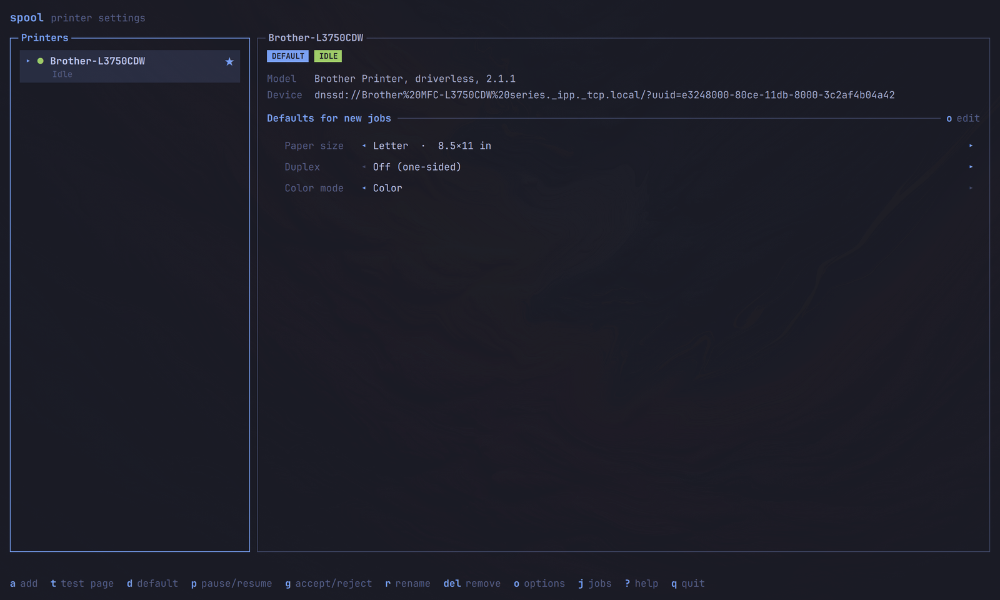
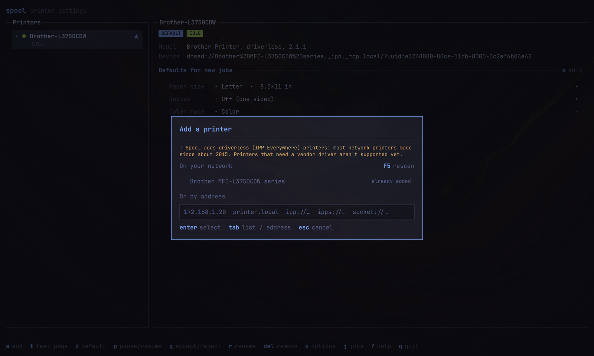

# Spool

Printer settings for [Omarchy](https://omarchy.org). One keyboard-driven window
to see your printers, add a network printer, set the default, print a test page,
pause a queue, pick paper size, duplex, color and quality, and watch or cancel
jobs. It replaces *Printer Settings* (`system-config-printer`).



It looks like the terminal apps around it: square bordered panels, your
terminal font, a key bar along the bottom. Colors, accent and font come from
the current Omarchy theme and change live when you switch themes.

| Jobs | Add a printer |
| --- | --- |
|  |  |

## Install

Spool is an Arch package built from this repo. On Omarchy:

```sh
git clone https://github.com/scottadair/omarchy-spool.git
cd omarchy-spool
bin/install
```

`bin/install` builds the binary, then runs `makepkg -fsi` (asks for your sudo
password) so Spool lands in the launcher (`Super + Space`, "Printer Settings").
Run it again after pulling changes.

To remove it: `sudo pacman -R spool`.

### Hide the old Printer Settings entry (optional)

A user-level override, so nothing under `/usr` is touched and
`system-config-printer` stays installed:

```sh
sed 's/^\[Desktop Entry\]/&\nNoDisplay=true/' \
  /usr/share/applications/system-config-printer.desktop \
  > ~/.local/share/applications/system-config-printer.desktop
```

Delete that file to bring the entry back.

### Requirements

`qt6-base`, `qt6-declarative`, `qt6-wayland`, `libcups`, `cups`,
`cups-pk-helper` and `cups-filters` (for `driverless` discovery). `bin/install`
pulls them in through the PKGBUILD.

## What it does

- **Printers**: name, state (idle, printing, stopped), state reasons such as
  toner low or paper jam, default marker, accepting and enabled.
- **Add**: finds network printers automatically (pick, name, add), or takes an
  address: a hostname, an IP, or an `ipp://`, `ipps://` or `socket://` URI.
- **Manage**: set default, print a test page, rename, remove (asks first),
  pause or resume, accept or reject jobs.
- **Defaults**: paper size, duplex, color mode and quality, from the values the
  printer itself reports.
- **Jobs**: active and completed jobs per printer; cancel and restart.

Spool supports driverless (IPP Everywhere) printers, which covers most network
printers made since about 2015. Printers that need a vendor driver aren't
supported yet, and the add dialog says so.

## Keyboard

| Key | Action |
| --- | --- |
| `↑` `↓` / `k` | Select printer |
| `a` | Add a printer (`F5` rescans, `Enter` continues, `Esc` goes back) |
| `t` | Print a test page |
| `d` | Make default |
| `p` | Pause / resume |
| `g` | Accept / reject jobs |
| `r` | Rename |
| `Delete` | Remove (asks first) |
| `o` | Edit defaults: `↑` `↓` pick a row, `←` `→` change it, `Esc` returns |
| `j` | Jobs for this printer |
| `x` / `r` | In Jobs: cancel / restart |
| `F5` | Refresh |
| `?` | Shortcuts |
| `q` | Quit |

## Permissions

Users on Omarchy aren't CUPS admins, so Spool never runs `lpadmin`.

- **Reading** (printers, options, jobs, discovery) uses libcups and needs no
  password. So do printing a test page and canceling or restarting your own jobs.
- **Changing a printer** (add, remove, rename, default, pause, accept jobs,
  option defaults) goes through `cups-pk-helper` on the system bus. The Omarchy
  polkit agent shows the password prompt. The approval is cached for the
  session, so expect about one prompt. A cancelled or denied prompt is shown in
  the window. Canceling someone else's job also goes through it.

## Develop

```sh
bin/build      # qmake6 + make -> build/spool
build/spool    # run it
bin/test       # Qt Test, offscreen: parsing, validation, the cups-pk-helper layer, theme
bin/install    # build the package and install it
```

Only `qmake6`, `make` and a C++ compiler are needed beyond the requirements
above. The layout:

```text
spool.pro               qmake project (one binary)
src/cupsdata.*          reads from CUPS with libcups: printers, options, jobs, test page
src/admin.*             Admin interface; PkHelperAdmin talks to cups-pk-helper over D-Bus
src/printeraddress.*    address and queue-name validation
src/backend.*           app state and actions, exposed to QML
src/rowmodel.*          list model that updates rows in place
src/theme.*             follows ~/.local/state/omarchy/current/theme/colors.toml
src/*.qml               the window and its components
tests/                  Qt Test cases; the admin layer is faked behind Admin
pkgbuild/               PKGBUILD, .desktop file and icon
```

Admin calls are asynchronous (`QDBusPendingCallWatcher`, ten-minute timeout) so
the window stays alive while someone types a password. Tests substitute a fake
`Admin`, so they never touch a real printer or ask for a password.

## License

MIT. See [LICENSE](LICENSE).
